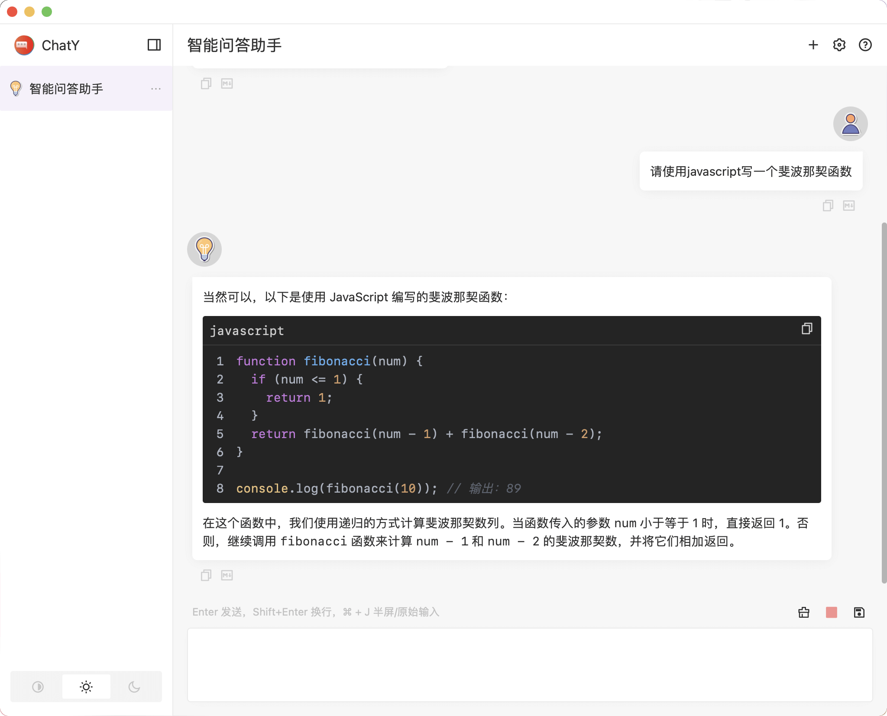
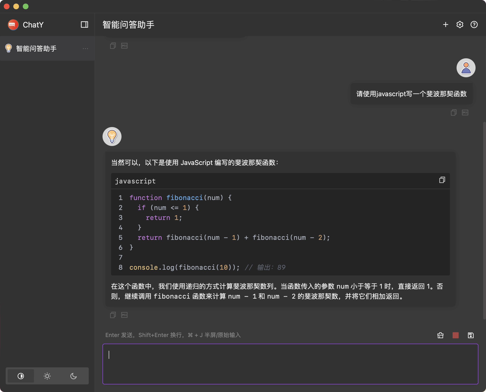

  
  <h1>ChatY</h1>

English | [中文](README-ZH.md)

ChatY is an open source GPT desktop client developed based on [wails](https://github.com/wailsapp/wails). It is probably the most beautiful ChatGPT assistant in your computer.

## Preview

  
 

## Features

- Support for multiple platforms.
- Data is completely localized, no user data is recorded.
- UI is completely independent and does not rely on third-party UI libraries.
- Interaction is simple and easy to use, supporting shortcut key operation.
- More controllable history session mode, which can ensure the accuracy of the results and save your token at the same time.
- Based on the MIT protocol , open-source and free.

## Download

[download here](https://github.com/CiroLee/ChatY/releases)

## LICENSE

[MIT License](https://github.com/CiroLee/ChatY/blob/main/LICENSE)
